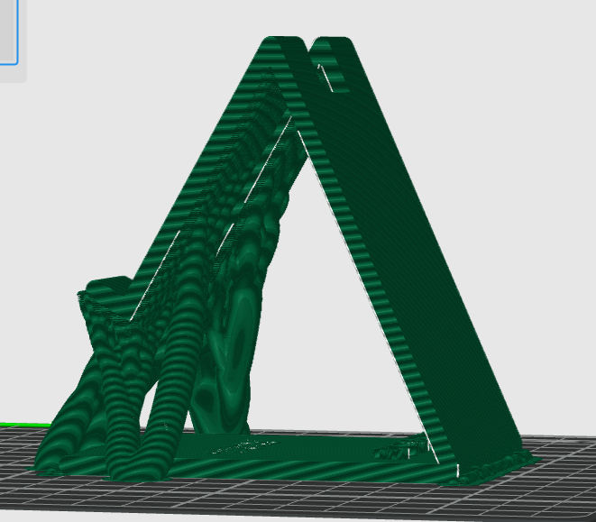
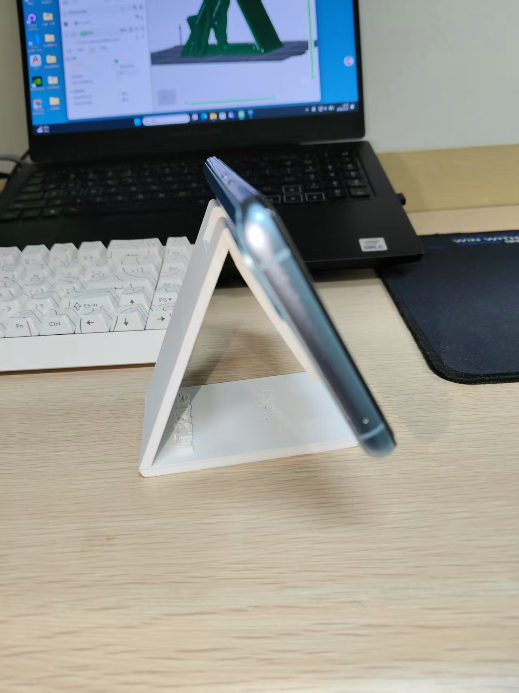
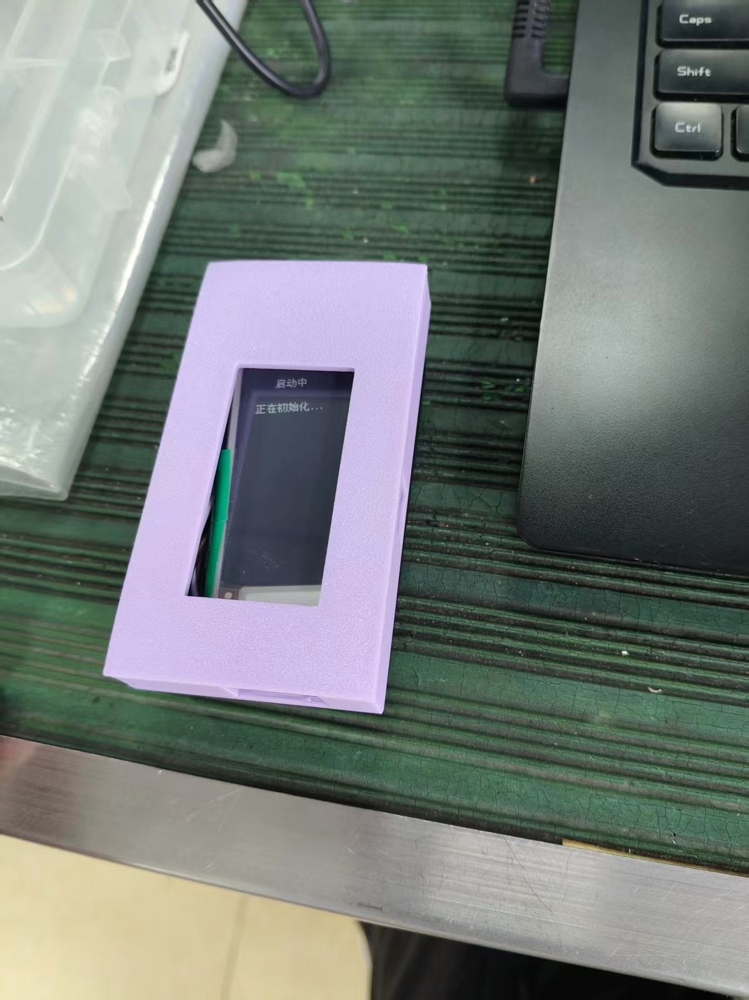
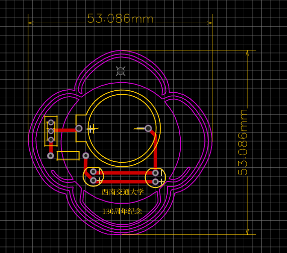
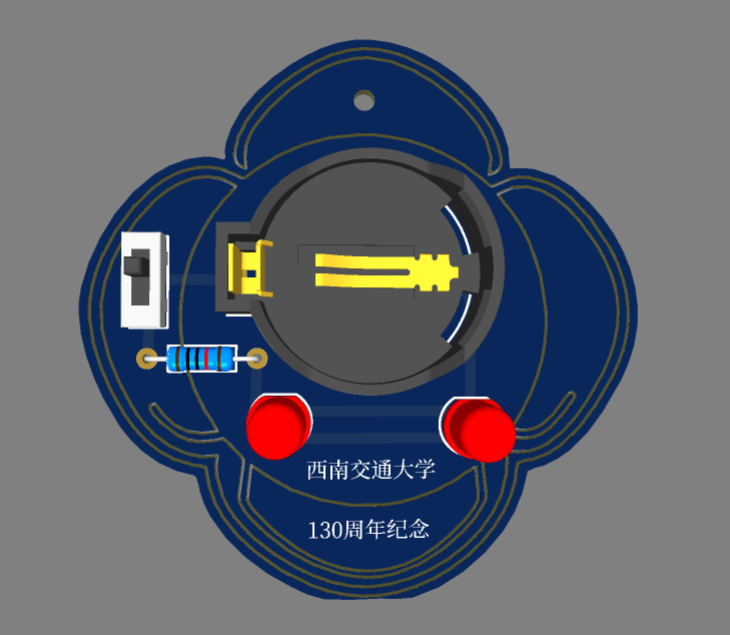
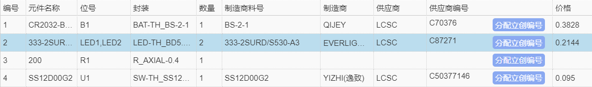
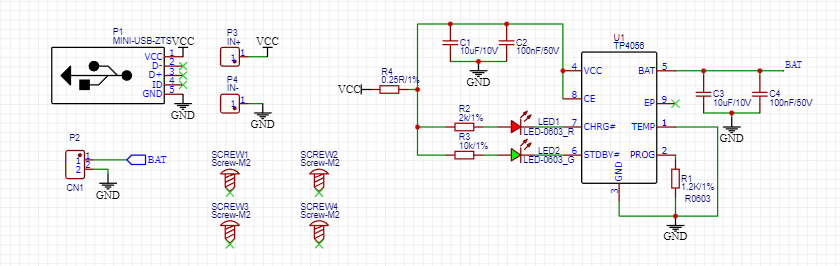
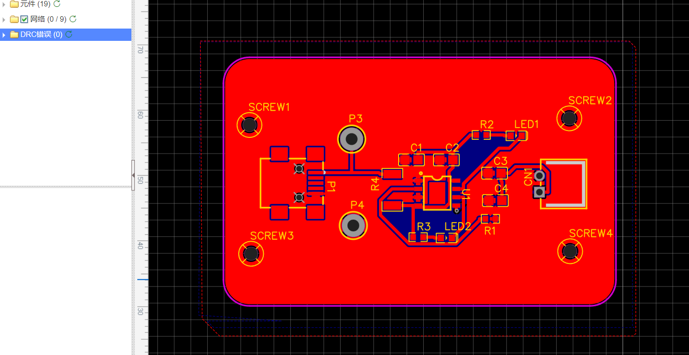
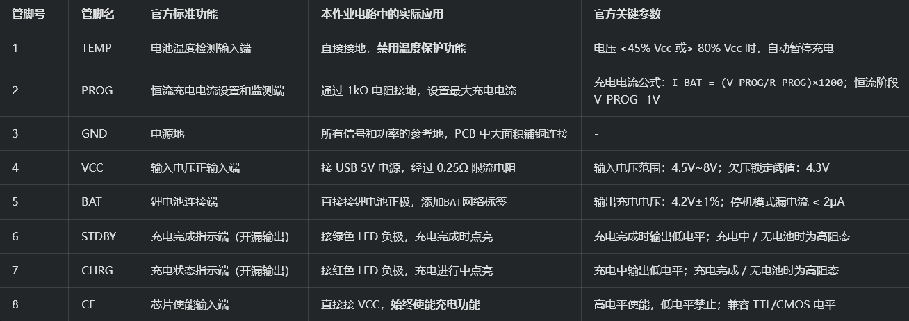
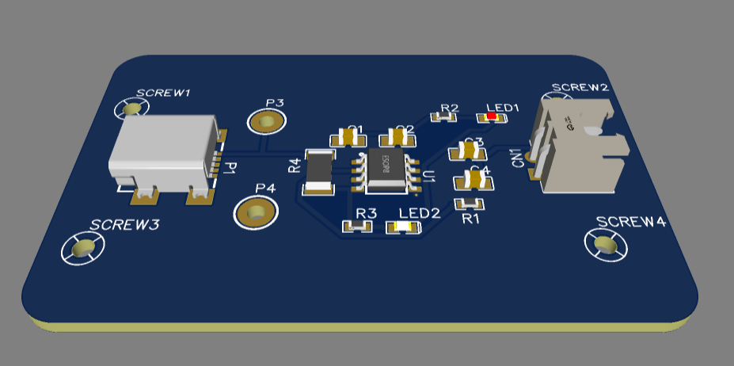

# code-to-physical

这是我的《从代码到实物》课程作业仓库，用来记录本学期从 Git/Gitee 基础操作、网页搭建、三维建模、3D 打印、嵌入式硬件、智能装置到 PCB 设计的学习过程。

本仓库会按照课程进度逐步更新。每完成一个阶段，我会先整理文字说明，再补充自己的截图、模型、代码、实物照片和演示材料，并通过 Git 提交到 Gitee 远程仓库。

## 一、第一次作业：Gitee 仓库创建与网页上传

### 1. 学习目标

- 熟悉 Git 与 Gitee 的基本使用流程。
- 建立本地仓库与远程仓库之间的连接。
- 学会使用 Markdown 编写仓库说明文档。
- 完成一个基础 HTML 页面，并上传到远程仓库。
- 为后续课程作业建立清晰的文件分类结构。

### 2. 已完成内容

- 创建了 Gitee 远程仓库 `code-to-physical`。
- 将远程仓库克隆到本地电脑。
- 初步整理了 `README.md`，作为课程作业总目录。
- 保留并准备继续完善首页文件 `index.html`。
- 规划了后续作业所需的资源目录。
- 上传了第一次作业的本地 Git 操作截图和网页展示截图。

### 3. 操作过程

本次作业先在 Gitee 上创建课程作业仓库，然后使用 Git 将仓库同步到本地电脑。进入本地仓库目录后，我依次练习了查看仓库状态、查看提交记录、确认远程仓库地址、推送到远程仓库等基本操作。

在完成基础操作后，我整理了 `README.md`，把原本的模板内容改成课程作业总目录，并建立了 `images`、`code`、`fusion_models`、`pcb`、`video` 等目录，方便后续每一次作业按照类型归档。

### 4. 成果展示

#### 本地 Git 操作截图


#### 网页展示截图


### 5. 仓库目录规划

```text
code-to-physical/
├── README.md                 # 课程作业总说明
├── index.html                # 课程展示网页
├── html/                     # 网页相关源文件或练习文件
├── images/                   # 作业截图、实物照片、过程图片
├── code/                     # 嵌入式程序、网页代码或其他源代码
├── fusion_models/            # Fusion 360、STL、3MF 等三维模型文件
├── pcb/                      # 原理图、PCB、Gerber 等电路设计文件
└── video/                    # 项目演示视频
```

### 6. 本阶段小结

第一次作业的重点不是完成复杂项目，而是先建立规范的仓库管理习惯。我通过本地仓库和远程仓库的同步练习，理解了 `git add`、`git commit`、`git push`、`git pull` 等基础命令的作用，也为后续每一次课程作业留下了统一的归档位置。

> 下一步需要补充：如果需要更完整展示，可以继续添加 Gitee 仓库页面截图或首页源代码说明。

---

## 二、第二次作业：3D 手机支架建模

### 1. 作业目标

本次作业围绕一个桌面手机支架展开，目标是完成从使用需求分析到三维模型建立的过程。手机支架需要能够稳定支撑手机，使手机在桌面上保持合适的观看角度，同时结构尽量简单，方便后续 3D 打印。

### 2. 设计思路

我将支架设计为三角支撑结构。底部使用较宽的底板提高稳定性，前端设置限位挡边，防止手机向前滑落；背部使用倾斜支撑面承托手机，让手机可以保持倾斜角度。整体结构采用对称布局，两侧支撑臂承担主要受力，中间留出空间以减少材料使用。

在建模过程中，我重点考虑了以下几点：

- 手机放置后不能轻易前滑或倾倒。
- 支架底部要有足够接触面积，保证桌面放置稳定。
- 支撑臂厚度不能过薄，避免打印后强度不足。
- 模型尽量减少复杂悬空结构，方便第三次作业继续切片和打印。

### 3. 建模成果

#### 3D 模型截图


#### 模型文件

- [支架 STL 模型文件](fusion_models/assignment2/支架.stl)

### 4. 本阶段小结

通过这次建模，我对 3D 作品从功能需求到结构设计的过程有了更直接的理解。手机支架虽然结构不复杂，但需要同时考虑承重、角度、限位和可打印性。建模完成后导出 STL 文件，为下一步 3D 打印切片和实物制作做好准备。

---

## 三、第三次作业：3D 打印作品

### 1. 作业目标

第三次作业是在第二次手机支架建模的基础上继续完成 3D 打印实践。目标是将已经导出的 STL 模型导入切片软件，检查模型摆放、支撑和打印路径，最后完成实物打印并进行使用测试。

### 2. 打印准备

我将手机支架模型导入 3D 打印切片软件中，观察模型在打印平台上的摆放效果。由于支架整体是倾斜三角结构，打印时需要关注支撑面、悬空部分和底部接触面积。切片预览中可以看到模型的层线和打印路径，这一步主要用于判断模型是否适合实际打印。

在准备打印时，我重点检查了以下内容：

- 模型是否完整导入，没有明显破面或缺失。
- 底板是否能够稳定贴合打印平台。
- 倾斜支撑臂是否需要支撑结构辅助成型。
- 前端挡边和支撑臂厚度是否能够满足打印强度。

### 3. 打印过程与成果

#### 切片与打印预览



#### 实物成果展示



#### 打印模型文件

- [手机支架 STL 打印文件](fusion_models/assignment3/支架.stl)

### 4. 使用效果

打印完成后，我将手机放置在支架上进行测试。从实物效果来看，支架可以支撑手机保持倾斜放置，前端挡边能够限制手机下滑，底板也能提供基本稳定性。整体作品完成了从三维模型到实物成品的转换。

### 5. 本阶段小结

通过第三次作业，我进一步理解了 3D 打印不仅是把模型导出后直接打印，还需要考虑切片方向、支撑结构、底部附着和成品强度。手机支架的打印过程让我认识到，建模阶段的结构设计会直接影响打印难度和最终使用效果。后续如果继续优化，可以在底部增加防滑结构，或调整支撑角度，让手机摆放更稳定。

---

## 四、第四次作业：嵌入式练习：WiFi 控制舵机

### 1. 作业目标

本次嵌入式练习的内容是使用 ESP32 通过 WiFi 控制舵机。目标是让开发板连接到指定无线网络，在局域网内开启一个简单网页服务，通过浏览器访问控制链接，使舵机转向不同位置。

### 2. 使用材料与环境

- 开发板：ESP32-S2 mini 或兼容 ESP32 开发板
- 执行机构：舵机
- 开发环境：Arduino IDE
- 主要库：`WiFi.h`
- 控制方式：浏览器访问 ESP32 的局域网 IP 地址，通过网页链接发送控制请求

### 3. 程序设计思路

程序启动后，先初始化串口，方便在串口监视器中查看 WiFi 连接状态和开发板 IP 地址。随后通过 `WiFi.begin(ssid, password)` 连接无线网络，连接成功后启动 80 端口的网页服务。

舵机控制部分使用 ESP32 的 LEDC PWM 输出。程序将舵机信号线连接到 `GPIO16`，频率设置为 50Hz。当浏览器访问 `/R` 时，程序输出较小占空比，让舵机转向一侧；当访问 `/L` 时，程序输出较大占空比，让舵机转向另一侧。

核心控制逻辑如下：

- `GET /R`：舵机向右转动
- `GET /L`：舵机向左转动
- 网页中提供两个链接按钮，方便在浏览器中直接点击控制

### 4. 成果文件

#### 源代码

- [WiFi 控制舵机源码](code/assignment4/wifi控制舵机源码.txt)

#### 演示视频

- [WiFi 控制舵机演示视频](video/assignment4/wifi控制舵机演示视频.mp4)

### 5. 调试过程

调试时，我先通过串口监视器确认 ESP32 是否成功连接 WiFi，并记录输出的局域网 IP 地址。然后在电脑或手机浏览器中输入该 IP，打开控制网页。点击网页中的左右控制链接后，浏览器会向 ESP32 发送 HTTP 请求，开发板收到 `/R` 或 `/L` 请求后改变 PWM 占空比，从而控制舵机转动。

### 6. 本阶段小结

这次练习让我理解了嵌入式设备接入 WiFi 后如何提供简单网页服务，也初步掌握了通过 HTTP 请求控制硬件输出的方法。相比单纯让舵机按固定程序转动，WiFi 控制舵机增加了网络交互过程，使 ESP32 从一个单机控制板变成了可以被浏览器远程访问的小型控制端。

---

## 五、中期项目（第五次作业）：ESP32 墨水屏阅读器

### 1. 项目主题

第五次作业是 ESP32 中期项目，我完成的是一个基于 ESP32 和墨水屏的简易电子书阅读器原型。项目目标是让开发板连接 WiFi 或开启热点，通过网页上传 TXT 书籍文件，再把文字内容分页显示到墨水屏上，并通过实体按键进行翻页和阅读控制。

由于项目演示结束后已经拆卸，制作过程没有完整保留照片和视频。本章节主要根据现有源码、外壳模型文件和拆卸后重组展示图进行整理，记录项目已经实现的功能和复盘总结。

### 2. 项目功能

本项目实现了以下核心功能：

- ESP32 启动后连接指定 WiFi，连接失败时可切换为热点模式。
- 在局域网内开启网页管理界面，用于上传和管理 TXT 书籍。
- 使用 SPIFFS 文件系统保存上传的书籍文件。
- 将 TXT 文本按墨水屏尺寸进行分页。
- 使用墨水屏显示中文文本内容和页码。
- 通过 Boot 按键实现下一页、上一页、退出阅读或打开书籍。
- 使用 Preferences 保存阅读记录，实现断点续读。
- 使用 3D 打印盒子和盖子作为外壳结构，便于项目展示。

### 3. 硬件与软件组成

- 主控：ESP32 / Wemos LOLIN32 Lite 类开发板
- 显示：2.13 英寸三色墨水屏
- 输入：Boot 实体按键
- 存储：ESP32 内部 SPIFFS 文件系统
- 外壳：3D 打印盒子与盖子
- 开发环境：Arduino IDE
- 主要库：`WiFi.h`、`ESPAsyncWebServer`、`GxEPD2_3C`、`SPIFFS`、`Preferences`、`ArduinoJson`、`OneButton`

### 4. 程序设计思路

程序启动后先初始化墨水屏和 SPIFFS 文件系统，然后尝试连接 WiFi。连接成功时，屏幕显示局域网 IP；如果连接失败，则 ESP32 开启 `EInk-Reader` 热点，方便电脑或手机直接连接。

网页端提供书籍上传、书籍列表、打开书籍和删除书籍等功能。上传的 TXT 文件会保存到 `/books` 目录。打开书籍后，程序根据屏幕尺寸、每行字数和每页行数建立页索引，再把对应页的文本刷新到墨水屏上。Boot 按键用于阅读时翻页，阅读记录会保存到 Preferences 中，断电重启后可以继续上次阅读位置。

### 5. 成果文件

#### 源代码

- [e-link 墨水屏阅读器源码](code/assignment5/e-link墨水屏阅读器源码.txt)

#### 外壳模型

- [盒子 STL 模型](fusion_models/assignment5/盒子.stl)
- [盖子 STL 模型](fusion_models/assignment5/盖子.stl)

#### 拆卸后重组展示



### 6. 项目复盘

这个中期项目把前面学到的 3D 打印、嵌入式开发、网页交互和文件管理结合在一起。相比第四次作业的 WiFi 控制舵机，本项目的难点更多：既要让 ESP32 提供网页服务，又要处理文件上传、文本分页、墨水屏刷新和按键逻辑。

不足之处是制作过程没有及时保留照片和视频，导致后期整理仓库时只能根据源码、模型和拆卸后重组图进行记录。后续再做类似项目时，需要在接线、烧录、调试、外壳装配和最终演示几个节点及时拍照或录屏，避免项目完成后材料不完整。

---

## 六、第六次作业：EDA 与 PCB 设计

本章节整理两次 EDA 与 PCB 相关作业。第一次作业是结合 AI 设计校庆元素 LED 电子徽章，重点练习 PCB 外形、元件布局、走线规范和 3D 预览；第二次作业是复刻 TP4056 充电管理电路，重点练习原理图复刻、芯片数据手册阅读、PCB 布局布线、铺铜和 DRC 检查。

### 1. PCB 第一次作业：校庆 LED 电子徽章

#### 作业要求

- 运用 AI 辅助设计 LED 电子徽章。
- 作品需要包含校庆元素。
- 电路使用 4 或 5 个主要元件。
- PCB 图中需要标注尺寸。
- 线条宽度为 1mm，拐弯采用 45 度。
- 提交 PCB 图和 3D 预览图。

#### 设计说明

本次电子徽章围绕西南交通大学 130 周年校庆主题展开。PCB 外形采用带装饰感的异形轮廓，中间放置纽扣电池座，底部加入“西南交通大学”和“130周年纪念”文字作为校庆元素。电路部分使用纽扣电池、开关、限流电阻和两个 LED，实现一个结构简单、便于展示的发光徽章。

在 PCB 绘制中，我标注了整体尺寸，控制外形约为 53mm 级别，并按照作业要求处理线宽和转角。布局时将电池座放在主体中心，开关和电阻放在侧边，两个 LED 放在下方作为发光展示点，使电路结构和视觉效果都比较直观。

#### 元件组成

从元件表可以看到，本次电子徽章主要包括：

- CR2032 纽扣电池座
- 两个红色 LED
- 一个限流电阻
- 一个拨动开关

#### 成果截图

##### PCB 图



##### 3D 预览图



##### 元件表



### 2. PCB 第二次作业：TP4056 充电管理板复刻

#### 作业要求

- 复刻 TP4056 典型应用原理图。
- TP4056 选型参考带散热片封装的 C16581。
- 阅读 C16581 数据手册，绘制管脚功能表格，并用自己的语言说明每个管脚功能。
- `BAT` 设置为网络标签，Mini USB-B 从用户贡献库选取。
- 原理图完成后进行网络检查。
- PCB 布局要求输入输出元件靠近板边，排列整齐，版面紧凑，边框层为圆角矩形。
- PCB 布线时 VCC 线适当加粗或填充，全板铺铜，铺铜网络设置为 GND。
- 完成 DRC 检查和优化。
- 导出 Gerber 制造文件。
- 提交原理图、PCB 图和管脚功能表。

#### 原理图复刻说明

本次作业复刻的是 TP4056 锂电池充电管理电路。输入端使用 Mini USB-B 接口提供 5V 电源，经过输入滤波电容后进入 TP4056 的 VCC 引脚。BAT 引脚连接锂电池正极，旁路电容用于稳定输出端电压。CHRG 和 STDBY 引脚分别连接红色和绿色指示 LED，用来显示充电中和充电完成状态。

PROG 引脚通过电阻接地，用于设置恒流充电电流。根据数据手册中的关系式，充电电流与 PROG 电阻成反比。本次电路中 PROG 使用约 1.2k 电阻，目标是设置接近 1A 的最大充电电流。TEMP 引脚直接接地，相当于不使用外部电池温度检测功能；CE 引脚接 VCC，使芯片上电后保持使能。

#### PCB 布局与布线说明

PCB 使用圆角矩形边框，Mini USB-B 输入接口和电池输出接口分别放在板边，方便接线和装配。TP4056 芯片位于板中央，输入电容、输出电容和指示灯围绕芯片放置，减少关键连接距离。PCB 图中可以看到 DRC 错误为 0，说明经过检查后已完成基础优化。

布线时，VCC、BAT、GND 等电源相关网络尽量缩短并适当加宽。全板铺铜设置为 GND 网络，有助于形成稳定参考地，也能为 TP4056 提供一定散热面积。3D 预览中可以看到 USB 接口、端子、LED、电阻电容和芯片的位置关系，整体布局比较紧凑。

#### 管脚功能理解

- `TEMP`：电池温度检测输入端，本作业中直接接地，表示不使用温度保护。
- `PROG`：充电电流设置与监测端，通过接地电阻设置充电电流。
- `GND`：电源地，作为全板信号和功率回路的参考点。
- `VCC`：输入电源端，接 USB 5V 输入，并通过电容滤波。
- `BAT`：电池正极连接端，输出充电电压给锂电池。
- `STDBY`：充电完成指示端，连接绿色 LED。
- `CHRG`：充电状态指示端，连接红色 LED。
- `CE`：芯片使能端，本作业中接 VCC，使芯片保持工作。

#### 电阻与电容作用分析

PROG 电阻决定充电电流，是本电路最关键的参数之一。指示灯串联电阻用于限制 LED 电流，避免指示灯过流损坏。输入端和 BAT 端的电容用于滤波和稳压，能够减小 USB 输入扰动和电池端电压波动，使 TP4056 在充电过程中更稳定。

#### 成果截图

##### 原理图



##### PCB 图



##### 管脚功能表



##### 组装 3D 预览图



### 3. 本阶段小结

通过两次 EDA 与 PCB 作业，我对从原理图到 PCB 的完整流程有了更清晰的认识。第一次电子徽章更偏向创意外形和简单电路实现，重点在于把校庆元素和 LED 发光功能结合起来；第二次 TP4056 充电板更偏向工程规范，需要阅读芯片资料、理解典型应用电路、完成网络检查、布局布线、铺铜和 DRC 优化。

这两次练习让我意识到，PCB 设计不仅是把元件连起来，还需要考虑接口位置、信号走向、电源线宽、散热、装配和制造文件输出。后续如果继续完善，可以补充 Gerber 文件归档，并记录每一步从原理图检查到制板导出的操作截图。

---

## 全学期课程总结

本章节将在所有课程作业完成后统一整理。
