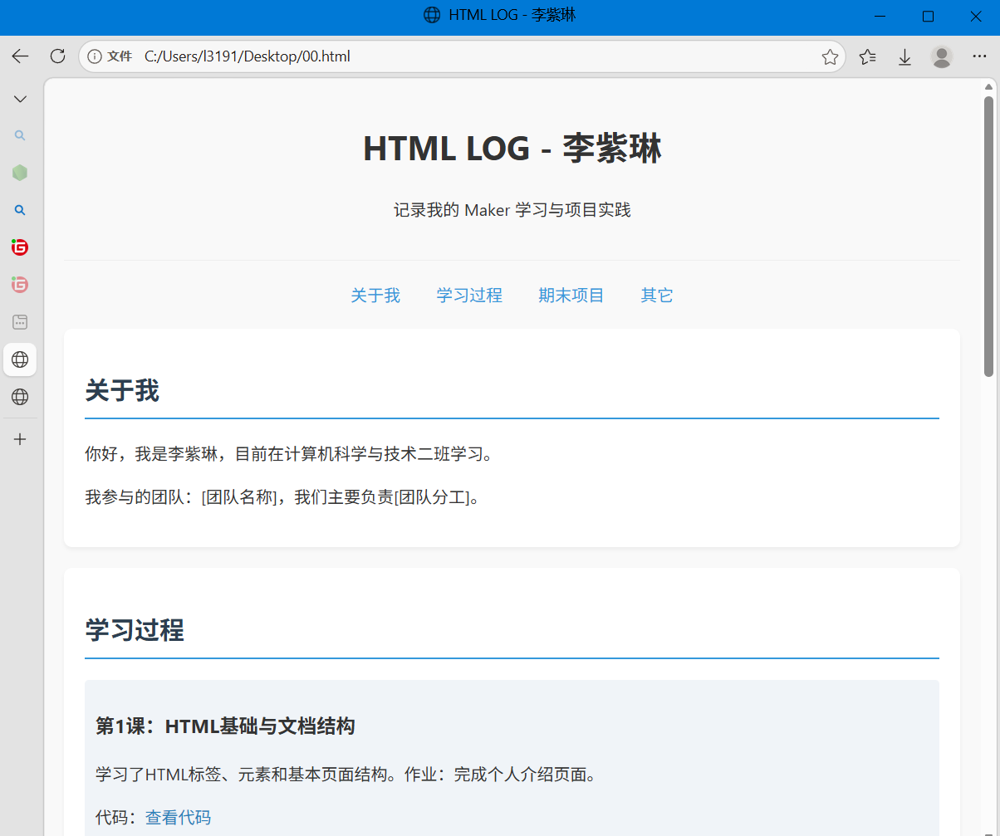
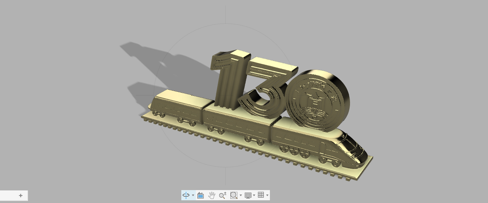
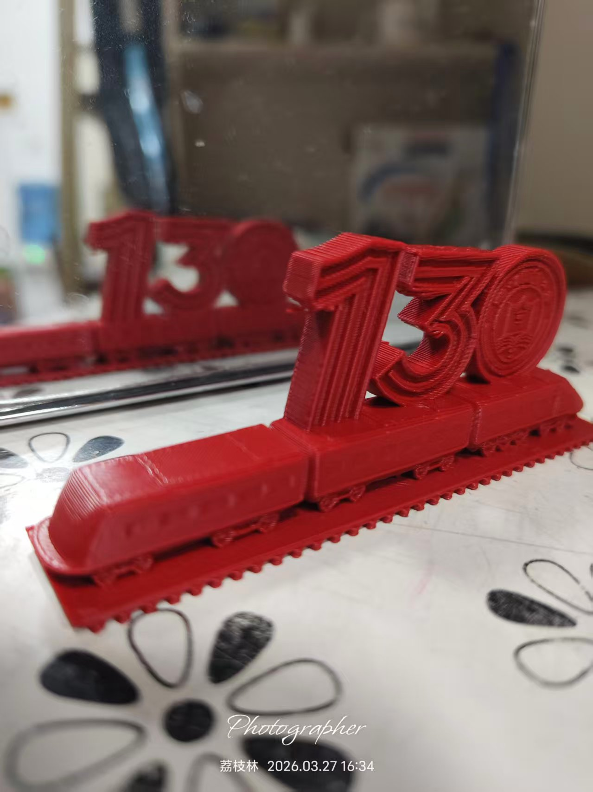
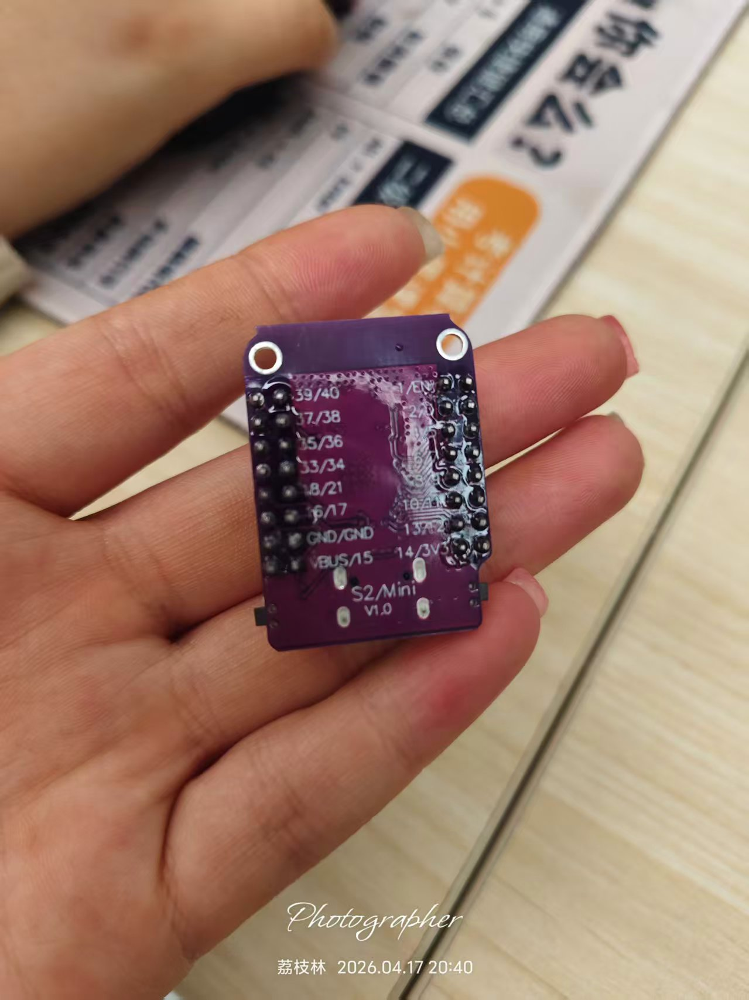
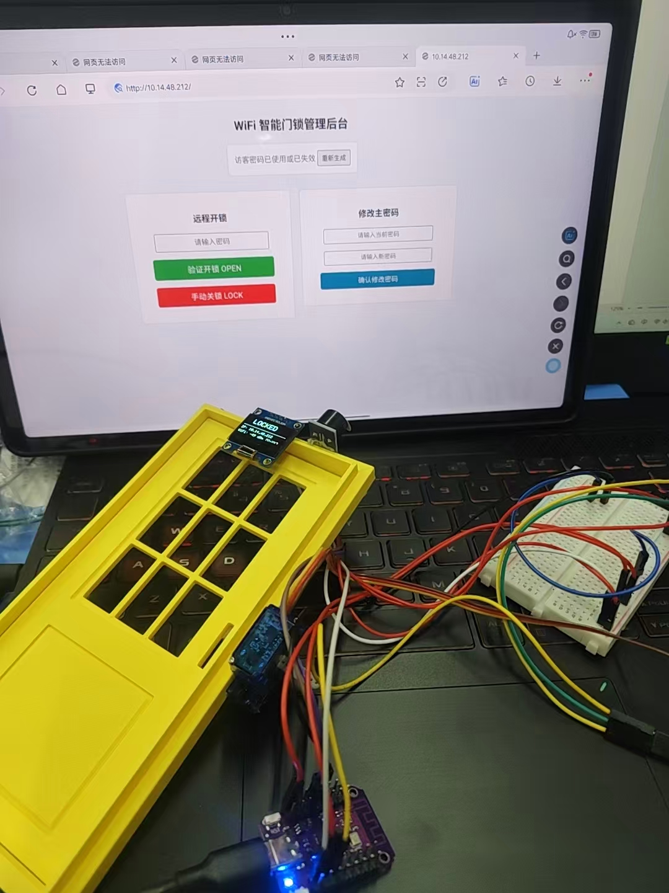
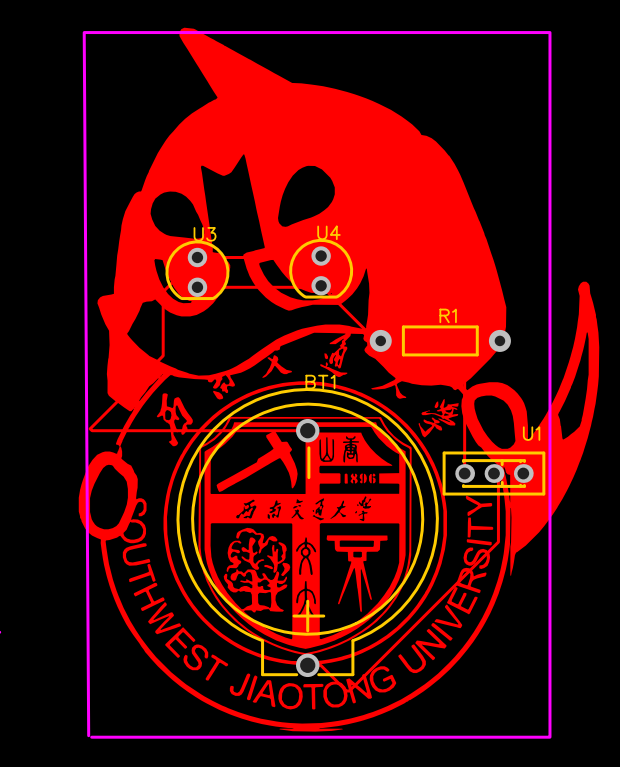
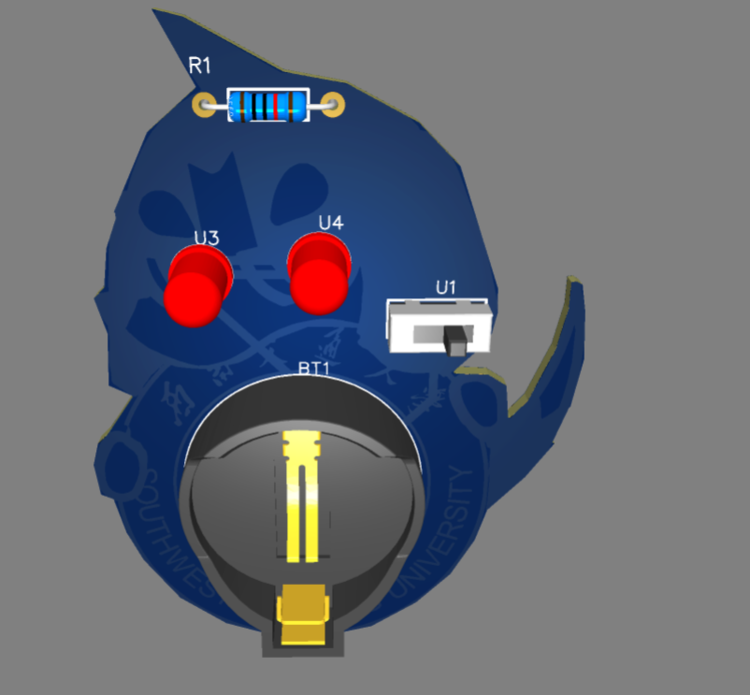

# my-project-2607
课程作业仓库，包含Gitee基础操作与嵌入式项目全周期实践，收纳本学期从版本控制、三维建模、嵌入式硬件到PCB电路设计所有作业源码、图纸、实拍素材与演示资料。

---

## 一、第一次作业：Gitee仓库创建与网页上传
### 🛠️ 开发工具与技术栈
- **版本控制**：Git Bash 命令行工具、Gitee 云端平台
- **开发工具**：VS Code 代码编辑器
- **前端技术**：HTML5, CSS 基础样式

### 作业目标
系统学习Git本地指令、Gitee云端仓库创建流程、Markdown语法规范与静态网页基础开发；熟练掌握本地文件提交、推送、拉取、版本回滚等仓库运维操作，搭建个人项目专属目录框架，完成首个HTML静态页面编写并云端部署。
1. 理解分布式版本控制原理，区分工作区、暂存区、本地仓库与远程仓库逻辑关系；
2. 自主规划仓库文件夹分类标准，为后续3D文件、源码、图片、视频预留独立目录；
3. 掌握基础HTML标签语法，实现简易静态页面排版，依托Gitee Pages完成文件在线预览。

### 💻 操作流程与作业成果
- **环境配置与克隆**：在本地安装 Git 环境，通过 `ssh-keygen -t rsa` 指令生成公私钥对，并在 Gitee 后台配置 SSH 公钥，实现本地与云端的免密通信。使用 `git clone` 将云端空仓库拉取至本地；
- **目录规范化**：自主分层搭建项目目录结构：`html/`存放网页源码、`embedded_code/`存放实拍图片、`code/`存放嵌入式程序、`fusion_models/`存放3D模型与PCB工程、`video/`存放功能演示视频；
- **网页开发与排错**：在 VS Code 中独立编写 `html/index.html`。初期在浏览器预览时遇到中文乱码问题，通过在 `<head>` 标签内补充 `<meta charset="UTF-8">` 声明解决。使用了 `<h1>` 到 `<h3>` 构建标题层级，`` 引入本地相对路径图片，并用 CSS 简单设置了图片宽度；
- **版本提交**：本地调试无误后，依次执行 `git add .`、`git commit -m "完成首次网页测试"`、`git push origin master` 完成全套提交推送流程。Gitee在线可直接打开访问。

### 我的网页文件
源码路径：`html/index.html`

### 网页效果展示

### 作业总结
本次作为课程入门项目，跳出软件实操本身，建立工程文件规范化归档思维。在实际操作演练中，首次尝试推送至云端时，由于云端仓库默认初始化了 `README.md` 文件而本地未进行同步，导致 Git 报出冲突并拒绝推送（Fetch First 报错）。通过查阅文档，我使用了 `git pull --rebase origin master` 指令，成功将云端变更拉取并与本地提交记录进行线性合并，顺利解决了同步冲突。后续全部作业统一沿用本次定下的分类规则，极大方便后期项目整理与老师查阅。

---
## 二、第二次作业：3D戒指设计（个人标识款戒指建模）
### 🛠️ 建模工具
- **软件**：Autodesk Fusion 360 (教育版)
- **核心命令**：草图绘制(Sketch)、拉伸(Extrude)、倒角(Chamfer)、浮雕(Emboss)、外观渲染(Appearance)

### 作业目标
1. 熟练掌握Fusion360全套基础建模操作，吃透参数化建模逻辑；
2. 结合个人专属标识元素完成个性化戒指结构设计，根据人体佩戴尺寸标定内外径、戒圈厚度参数，输出可用于3D打印的STL模型；
3. 练习模型文件多格式导出，整理源文件、STL文件、渲染效果图并规范入库Gitee。

### ⚙️ 设计说明与操作细节
本次戒指设计以个人标识 `lizilin2607` 为核心设计元素，整体采用宽戒圈简约结构：
- **参数化尺寸控制**：在建模初期，我打开了 Fusion360 的“更改参数(Change Parameters)”面板，将戒指内径设为变量 `Inner_Dia = 17mm`，壁厚设为 `Thickness = 1.2mm`，环宽设为 `Width = 6mm`。后期调整尺寸时只需修改变量，整个模型会自动按比例更新，规避了逐个修改草图的繁琐；
- **外观设计与工艺**：戒圈外表面添加仿木纹肌理纹理，搭配不规则锤纹凹凸效果提升产品质感；戒圈侧壁采用镂空浮雕工艺嵌入手写个人ID，实现标识与产品结构一体化；
- **文件说明**：项目留存 `*.3mf` 原始工程文件与导出STL打印文件，STL文件兼容市面主流切片软件，支持FDM/光固化两类成型工艺。

### 作业成果展示
#### 1. 戒指3D渲染效果

#### 2. 模型文件
- 工程源文件：[ring_model.stl](fusion_models/李紫琳戒指.3mf)

### 作业总结与排错记录
初次完整走完从创意构思→草图建模→细节修饰→渲染出图→文件导出归档全流程。在建模过程中，曾由于直接在弯曲的圆柱面戒圈上使用“拉伸”命令生成实体文字，导致边缘字母严重拉伸变形，并伴随破面报错。为解决这一故障，我改变了建模策略：先利用“构造(Construct)”工具创建与戒圈外壁相切的“切线平面(Tangent Plane)”，在此平面上绘制 ID 文本草图，接着放弃拉伸指令，转而使用专门的“浮雕（Emboss）”特征工具，成功使文本深度均匀地包裹于戒圈曲面。本次实践打牢了参数化设计的基础。

---
## 三、第三次作业：3D打印（学校文创130火车）主题戒指设计
### 🛠️ 工具与工艺流程
- **建模与渲染**：Autodesk Fusion 360
- **切片软件**：Bambu Studio (适配 FDM 3D打印机)
- **版本控制拓展**：Git LFS (Large File Storage)

### 作业主题
围绕西南交大130周年火车文创IP开展双人小组协作开发，以戒指为载体融合校园特色元素，落地一款校园纪念文创产品，完整覆盖方案设计、三维建模、参数优化、切片打印、素材归档全链路，是本学期首个正式团队协同项目。

### 小组分工
- **成员2584**：项目方案构思、火车元素结构（SVG矢量图导入与调整）、Fusion360主体建模、模型壁厚优化；
- **成员2607**：产品渲染配色、效果图后期处理、Bambu Studio 切片参数设置与实物打印测试、实物拍摄、项目文档编写、大文件归档上传。

### ⚙️ 设计说明与打印参数优化
- **核心元素融合**：将130火车、校徽相关文创元素提取为平面矢量轮廓，在 Fusion360 中投影至戒圈环面并进行精细的布尔运算（合并与剪切），紧扣校园文创主题；
- **渲染材质**：在渲染工作区，整体选用复古木纹渲染，局部调整粗糙度参数（Roughness）并叠加法线贴图（Normal Map），模拟真实的复合手作质感；
- **3D打印切片调优**：最终 `train.stl` 导出后导入 Bambu Studio。由于戒指体积较小且表面带有复杂浮雕，常规的 0.2mm 层高会导致阶梯纹明显。我将**打印层高降低至 0.12mm** 提升精度，并将填充模式设为 **15% 螺旋填充(Gyroid)** 保证结构强度的同时减轻重量。针对火车头微小的悬空结构，开启了**“树状支撑(Tree Support)”**，完美杜绝了打印过程中的拉丝与塌陷断裂。

### 作业成果展示
#### 1. 戒指3D渲染效果

#### 2. 戒指实物参考图

#### 3. 3D打印模型文件
- STL模型文件：[train.stl](fusion_models/train.stl)

### 作业总结
本项目有效锻炼了团队的分工协作能力。除了解决 3D 打印的悬空塌陷问题外，在提交作业时我们还遇到了大文件上传拦截：由于生成的 STL 模型包含大量精细三角面片，体积达到 23.79MB，超过了 Git 常规推送限制。为此，我在本地终端安装了 Git LFS 组件，运行 `git lfs install` 初始化，并使用 `git lfs track "*.stl"` 命令追踪模型文件，最终成功突破体积限制将其推送到 Gitee 仓库。

---
## 四、第四次作业：嵌入式项目（ESP32基础硬件焊接实训）
### 🛠️ 硬件加工工具
- **设备耗材**：恒温电烙铁、高纯度焊锡丝、松香/液体助焊剂、吸锡带、防静电镊子
- **检测工具**：数字万用表

### 作业目标
1. 熟悉ESP32-WROOM-32主控芯片引脚定义，练习直插元件（排针）与贴片辅助元件的手工焊接规范；
2. 学习硬件通断测量方法，使用万用表蜂鸣档排查虚焊、短路、引脚连锡等常见焊接故障。

### 🔌 操作流程与调试状态
- **排针焊接技巧**：先将排针插入面包板进行辅助固定，防止焊接时排针歪斜。采用“对角线固定法”，先焊板子两端的两个对角引脚定位，确认板子与排针垂直后，再依次焊接剩余引脚；
- **调试状态**：焊接完成后，通过万用表的蜂鸣档逐一测量相邻引脚是否存在短路，并打到电压档测试 3.3V 与 5V 供电是否正常输出。目前全引脚导通检测完毕，可用于后续第五次门锁项目载体。

### 作业总结与故障排除
作为嵌入式硬件入门实操，本次实训打破了纯软件学习的局限。焊接初期，由于未控制好烙铁温度和送锡时间，频繁出现“连锡”短路和松香焦化的“虚焊”。发现问题后，我将**烙铁温度恒定在 350℃**。面对连锡点，我涂抹适量助焊剂，覆上**吸锡带**并用烙铁加热，利用毛细现象将多余焊锡完美吸除；为了防止虚焊，我严格纠正了操作手势，落实了**“烙铁头同时加热引脚与焊盘 → 喂锡 → 快速撤锡丝 → 移开烙铁”的标准四步法**，最终焊盘呈现出饱满光亮的圆锥形。焊好的开发板直接复用到了后续项目，有效节约了调试成本。

---
## 五、第五次作业：ESP32 WiFi舵机 + 智能门锁（两级递进开发项目）
### 🛠️ 软硬件开发环境
- **开发软件**：Arduino IDE (安装 ESP32 Board Manager 核心板包)
- **依赖库(Libraries)**：`WiFi.h` (网络通信), `WebServer.h` (网页服务), `ESP32Servo.h` (舵机PWM), `U8g2` (OLED显示), `Preferences.h` (Flash存储)
- **硬件清单**：ESP32主控、SG90微型舵机、0.96寸 I2C OLED屏幕、有源蜂鸣器、3D打印定制门锁组件、面包板及杜邦线

### 作业主题
本项目分前后两阶段循序渐进：第一阶段裸板验证ESP32网页远程控制SG90舵机，吃透WiFi底层；第二阶段整合OLED、蜂鸣器与3D打印机械结构，升级为带声光提示、密码校验与掉电保存功能的成品智能门锁，全程涵盖电路搭建、C++代码编写与联调。

### 项目一：基础阶段 —— WiFi无线控制舵机
- **底层逻辑**：ESP32 包含集成 WiFi 模块，代码中配置固定的 SSID 与 Password 使其接入局域网。初始化 `WebServer` 并在 80 端口监听 HTTP 请求；
- **控制实现**：网页前端代码（HTML+CSS+JS）作为字符串写入 C++ 中。浏览器点击按键时发起 GET 请求（如 `/?angle=90`），后端提取参数后调用 `servo.write(90)` 输出对应占空比的 PWM 波，精准定位舵机转角。

### 项目二：进阶阶段 —— 多功能WiFi智能门锁（最终成品）
- **3D打印结构封装**：利用装配体预留公差，自主建模打印门框锁舌；
- **OLED数据刷新**：通过 I2C 协议实时展示联网状态、动态 IP 及门锁开关标志；
- **蜂鸣器声光提示**：利用 `delay()` 控制高低电平翻转，赋予开锁、锁门、密码错误不同频率的提示音；
- **Flash掉电存储**：引入 `Preferences` 库建立非易失性存储空间，将修改后的管理员密码写入单片机内部 Flash，断电重启不丢失。

### 仓库文件资源路径
- [智能门锁完整工程源码](fusion_models/智能门锁\(1\).cpp)
- [WiFi舵机硬件接线实拍图](embedded_code/d36a9f344aa63965392b2f34183cb63.jpg)
- [3D打印智能门锁整机实物图](embedded_code/9c3e36b1b1304735e618e18dda4f3fc.jpg)
- [WiFi舵机功能演示视频](embedded_code/20260429230759814.mp4)

### 实物成果展示
#### 1. WiFi舵机硬件接线实拍

#### 2. 3D打印成品智能门锁整机实拍

### 作业总结与深度排错复盘
本项目贯彻由简到繁的迭代思想。联调阶段接连遭遇三大核心技术阻碍，我们在组内分工逐一击破：
1. **OLED屏幕黑屏不亮**：接线与代码编译均无误。我额外烧录了一段 `I2C Scanner` 测试代码扫描总线，发现买到的屏幕硬件地址为 `0x3C`，而库默认初始化为 `0x3D`。修改初始化函数 `u8g2.begin(0x3C)` 后画面瞬间点亮；
2. **舵机剧烈抖动与单片机重启**：当舵机转动并伴随蜂鸣器响时，单片机大概率崩溃。使用万用表监测发现，舵机启动瞬间拉流过大，导致 ESP32 的 5V 引脚电压骤降（Brownout）。我们立刻引入面包板电源模块**为舵机独立供电**，并严格将**电源模块 GND 与 ESP32 GND 共地连接**，彻底消除了抖动与复位现象；
3. **结构件装配过紧**：由于 FDM 3D打印存在的“孔洞收缩”热胀冷缩物理特性，初次打印的舵机卡槽无法塞入舵机。我们在 Fusion360 中为所有孔洞追加了 **0.25mm 的装配公差**后重新切片打印，实现了完美契合。

---
# 六、第六次作业：立创EDA硬件设计（电子徽章与TP4056充电板原理图&PCB）
### 🛠️ EDA设计工具链
- **软件**：立创 EDA (EasyEDA 标准版)
- **工艺参数**：嘉立创 1.6mm 双层板，绿油白字，沉金/喷锡工艺
- **核心流程**：元器件选型搜索 → 原理图连线(Schematic) → ERC检查 → 导入PCB → 边框/丝印设计 → 布局布线(Routing) → 覆铜(Copper Pour) → DRC检查 → 导出 Gerber

### 作业目标
完成两款PCB项目：交大校徽电子徽章电路板（注重异形外观与DXF矢量图丝印处理）、TP4056锂电池充电管理板（注重电源拓扑、大电流走线规范与热设计），生成量产生产文件打包入库。

### 📂 项目一：西南交通大学主题电子徽章
- **设计概述**：将交大校徽图片转换为 DXF 矢量图后，导入立创 EDA 的**边框层（Board Outline）**生成异形板框；
- **硬件电路**：采用侧插式拨动开关作为电源总控，CR2032 纽扣电池座进行 3V 便携供电。为防止 LED 烧毁，根据公式 `(3V - LED正向压降) / 目标电流` 精确计算并串联了限流电阻。

### 📂 项目二：TP4056 锂电池充电管理板（原理图复刻）
- **电路功能**：复刻 TP4056 经典线性充电电路，实现 5V Mini-USB 输入、3.7V 锂电池恒流恒压充电，PROG 引脚外接 1.2k 电阻设定 1A 快充电流，红绿双色 LED 指示充放电状态；
- **滤波设计**：在 VCC 输入端与 BAT 输出端，严格遵循“大电容低频滤波，小电容高频滤波”原则，并联放置了 10uF 与 0.1uF 贴片电容，有效稳定电源纹波。

### 3. PCB 布局布线亮点与生产准备
- **布局规则**：按照“输入接口 → 滤波电容 → 主控芯片 → 滤波电容 → 输出接口”的直线型信号流向进行元器件摆放，确保滤波电容紧贴芯片引脚；
- **生产文件(Gerber)**：全套文件包含顶层、底层、阻焊层(Solder Mask)、丝印层(Silk Screen)、钻孔层，可直接发往工厂投产；
- **Gerber 文件下载**：[点击下载 Gerber 压缩包](fusion_models/Gerber_PCB2_PCB_PCB2_2_2026-05-16%20(1).zip)

### 🖼️ 成果展示
#### 1. 电子徽章效果

#### 2. 充电管理板效果

### 作业总结与布线规范优化
首次系统学习 PCB 全流程。初期设计 TP4056 充电板时，由于缺乏电源设计常识，我贪图方便点击了“自动布线”，结果软件默认使用 10mil 的极细线宽连接了所有网络，且电源主回路绕线极长。如果接入 1A 充电电流，这种细线必然会严重发热甚至烧毁。
发现严重缺陷后，我果断**撤销自动走线，改为全手工布线**：
1. **加粗功率走线**：在设计规则中，将 VBUS (USB输入)、BAT (电池端) 以及 GND 网络的线宽强制加粗至 **35mil 到 40mil**；
2. **强化芯片散热**：TP4056 线性压降大发热严重，我不仅在底部大面积铺设了接地的铜皮（Copper Pour），还在芯片底部的裸露焊盘处打满了**多个散热过孔（Thermal Vias）**，将热量传导至 PCB 底层散开；
3. **消除 DRC 报错**：在校徽异形板中，因为图案复杂导致丝印层与板框裁切线重叠报错，我通过调整全局**安全清空间距（Clearance）至 8mil** 并重构覆铜区域，顺利通过了严苛的 DRC（设计规则检查）。

---
## 全学期课程总结
### 一、全学期团队合作复盘
本学期第三项火车文创戒指、第五项ESP32智能门锁两大项目采用双人固定组队模式，全程落地规范化分工机制：成员2584聚焦方案设计、代码/建模主体开发、硬件电路调试；成员2607负责3D结构优化、切片参数调整、素材拍摄录制、文档撰写、Gitee仓库运维。项目推进过程中，我们习惯使用 Git 的分支机制进行代码隔离，遇到硬件玄学故障（如供电不足导致的复位）时共同研读芯片手册与电路图。所有修改版本、排错思路完整留存，实现了从初期磨合低效到后期高效互补的协作闭环。

### 二、学期整体学习收获
回溯这一学期，我已成功从零建立起一套标准化的硬件工程项目开发思维逻辑：**需求拆解 → 方案与器件选型 → 原理图绘制与PCB设计 → 3D结构件建模打样 → 嵌入式底层驱动编写 → 软硬件系统联调与排错 → Git/Gitee云端资料归档**。
熟练掌握了 Git 版本控制系统、Fusion360 复杂曲面与装配建模、Arduino C++ 嵌入式控制栈以及立创 EDA 电路板量产设计等四大核心工程技能。这份图文并茂的仓库不仅是作业成果的汇总，更是未来参与毕业设计、科创竞赛乃至步入职场最扎实的项目技术资产。
