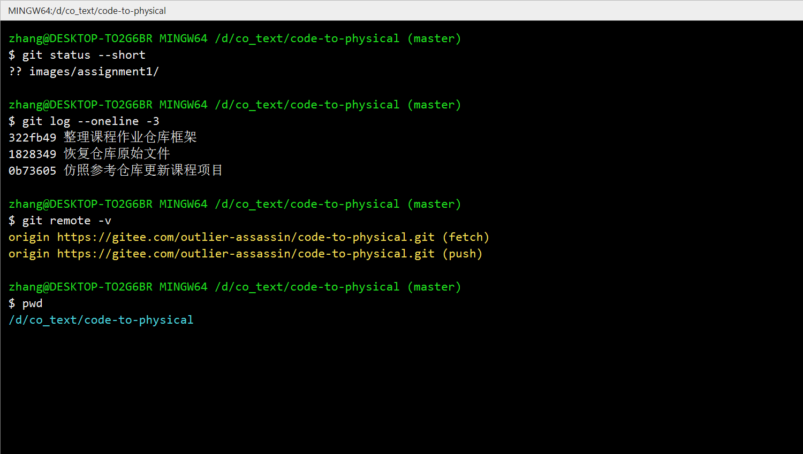
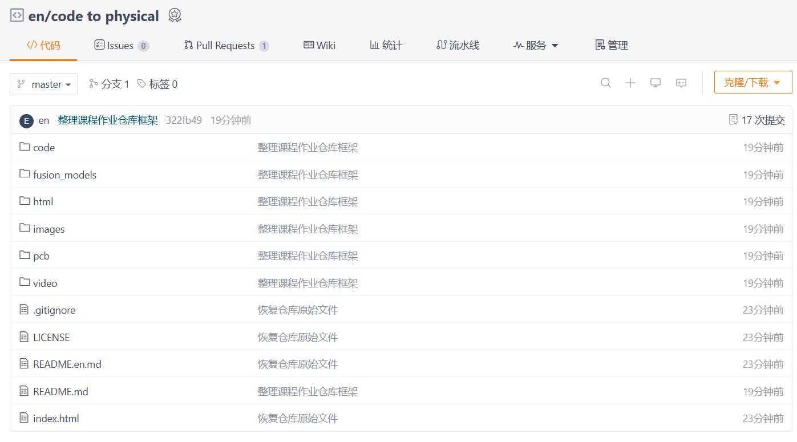
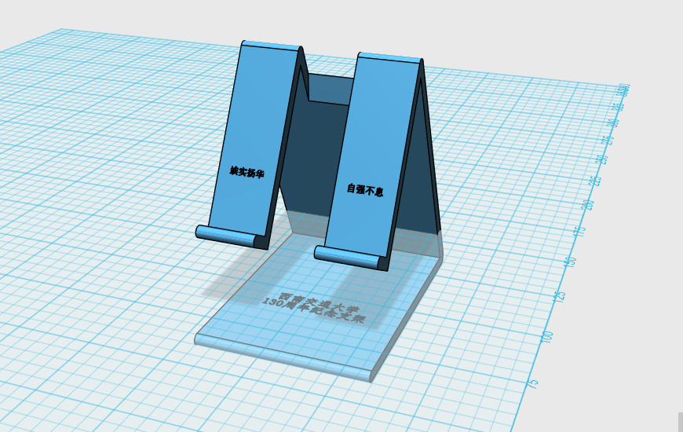

# code-to-physical

这是我的《从代码到实物》课程作业仓库，用来记录本学期从 Git/Gitee 基础操作、网页搭建、三维建模、3D 打印、嵌入式硬件、智能装置到 PCB 设计的学习过程。

本仓库会按照课程进度逐步更新。每完成一个阶段，我会先整理文字说明，再补充自己的截图、模型、代码、实物照片和演示材料，并通过 Git 提交到 Gitee 远程仓库。

## 一、第一次作业：Gitee 仓库创建与网页上传

### 1. 学习目标

- 熟悉 Git 与 Gitee 的基本使用流程。
- 建立本地仓库与远程仓库之间的连接。
- 学会使用 Markdown 编写仓库说明文档。
- 完成一个基础 HTML 页面，并上传到远程仓库。
- 为后续课程作业建立清晰的文件分类结构。

### 2. 已完成内容

- 创建了 Gitee 远程仓库 `code-to-physical`。
- 将远程仓库克隆到本地电脑。
- 初步整理了 `README.md`，作为课程作业总目录。
- 保留并准备继续完善首页文件 `index.html`。
- 规划了后续作业所需的资源目录。
- 上传了第一次作业的本地 Git 操作截图和网页展示截图。

### 3. 操作过程

本次作业先在 Gitee 上创建课程作业仓库，然后使用 Git 将仓库同步到本地电脑。进入本地仓库目录后，我依次练习了查看仓库状态、查看提交记录、确认远程仓库地址、推送到远程仓库等基本操作。

在完成基础操作后，我整理了 `README.md`，把原本的模板内容改成课程作业总目录，并建立了 `images`、`code`、`fusion_models`、`pcb`、`video` 等目录，方便后续每一次作业按照类型归档。

### 4. 成果展示

#### 本地 Git 操作截图



#### 网页展示截图



### 5. 仓库目录规划

```text
code-to-physical/
├── README.md                 # 课程作业总说明
├── index.html                # 课程展示网页
├── html/                     # 网页相关源文件或练习文件
├── images/                   # 作业截图、实物照片、过程图片
├── code/                     # 嵌入式程序、网页代码或其他源代码
├── fusion_models/            # Fusion 360、STL、3MF 等三维模型文件
├── pcb/                      # 原理图、PCB、Gerber 等电路设计文件
└── video/                    # 项目演示视频
```

### 6. 本阶段小结

第一次作业的重点不是完成复杂项目，而是先建立规范的仓库管理习惯。我通过本地仓库和远程仓库的同步练习，理解了 `git add`、`git commit`、`git push`、`git pull` 等基础命令的作用，也为后续每一次课程作业留下了统一的归档位置。

> 下一步需要补充：如果需要更完整展示，可以继续添加 Gitee 仓库页面截图或首页源代码说明。

---

## 二、第二次作业：3D 手机支架建模

### 1. 作业目标

本次作业围绕一个桌面手机支架展开，目标是完成从使用需求分析到三维模型建立的过程。手机支架需要能够稳定支撑手机，使手机在桌面上保持合适的观看角度，同时结构尽量简单，方便后续 3D 打印。

### 2. 设计思路

我将支架设计为三角支撑结构。底部使用较宽的底板提高稳定性，前端设置限位挡边，防止手机向前滑落；背部使用倾斜支撑面承托手机，让手机可以保持倾斜角度。整体结构采用对称布局，两侧支撑臂承担主要受力，中间留出空间以减少材料使用。

在建模过程中，我重点考虑了以下几点：

- 手机放置后不能轻易前滑或倾倒。
- 支架底部要有足够接触面积，保证桌面放置稳定。
- 支撑臂厚度不能过薄，避免打印后强度不足。
- 模型尽量减少复杂悬空结构，方便第三次作业继续切片和打印。

### 3. 建模成果

#### 3D 模型截图



#### 模型文件

- [支架 STL 模型文件](fusion_models/assignment2/支架.stl)

### 4. 本阶段小结

通过这次建模，我对 3D 作品从功能需求到结构设计的过程有了更直接的理解。手机支架虽然结构不复杂，但需要同时考虑承重、角度、限位和可打印性。建模完成后导出 STL 文件，为下一步 3D 打印切片和实物制作做好准备。

---

## 三、第三次作业：3D 打印作品

本章节待补充。后续将记录模型设计、切片参数、打印过程、实物照片和问题总结。

---

## 四、第四次作业：嵌入式硬件基础

本章节待补充。后续将记录 ESP32 或相关开发板的焊接、接线、测试和排错过程。

---

## 五、第五次作业：ESP32 智能装置项目

本章节待补充。后续将记录项目功能、硬件清单、程序代码、调试过程和演示效果。

---

## 六、第六次作业：EDA 与 PCB 设计

本章节待补充。后续将记录原理图设计、PCB 布局布线、DRC 检查、Gerber 文件导出和成品展示。

---

## 全学期课程总结

本章节将在所有课程作业完成后统一整理。
